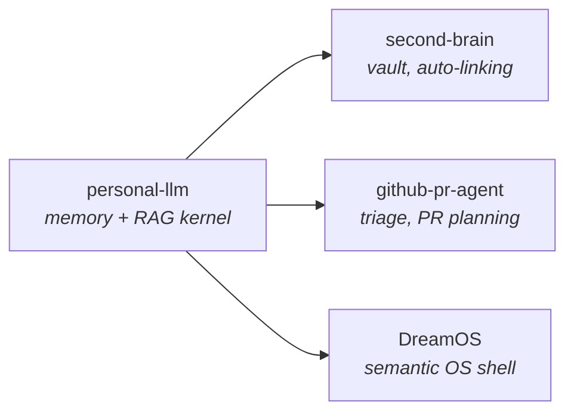

I build AI systems that remember, retrieve, and decide - and I measure whether they actually work.

Most of what follows is a number. Every number is a link to the artifact that produced it: the merged pull request, the raw model output, the test run, the reproducible script. Nothing here asks to be believed.

Open to **AI engineer / applied AI internship** roles.

---

## The short version, with receipts

| Claim | Proof |
|---|---|
| 3 pull requests merged into upstream OSS totalling **13.4k stars** | [tenacity #668](https://github.com/jd/tenacity/pull/668) · [returns #2480](https://github.com/dry-python/returns/pull/2480) · [gqlalchemy #390](https://github.com/memgraph/gqlalchemy/pull/390) |
| 27 pull requests merged into a **live production product** I did not build | [case study](case-studies/zabira-academy.md) |
| 2 original research findings, each with a negative control and a second-model replication | [COLD READ](https://github.com/zaidwhy/coldread) · [AUGUR](https://github.com/zaidwhy/augur) |
| A retrieval method benchmarked against 6 baselines - including the version of it that **failed** | [TCMF write-up](https://github.com/zaidwhy/CivilizationOS/blob/main/docs/tcmf.md) |
| Every commit on this account is cryptographically signed | [PROVENANCE.md](PROVENANCE.md) |

<details>
<summary><b>Don't take my word for any of it - here is how to falsify this page</b></summary>

<br>

```bash
# The merged pull requests. Check the author field.
gh pr view 668  --repo jd/tenacity         --json state,mergedAt,author
gh pr view 2480 --repo dry-python/returns  --json state,mergedAt,author
gh pr view 390  --repo memgraph/gqlalchemy --json state,mergedAt,author

# The research. Re-run the analysis on the shipped raw data.
git clone https://github.com/zaidwhy/coldread && cd coldread
python analyze.py out/results-qwen2.5_7b-instruct.jsonl

# The commit signatures.
git clone https://github.com/zaidwhy/augur && cd augur
git log --show-signature -3
```

If any of it does not reproduce, the claim above is wrong and I want to know.

</details>

---

## Research

Two studies. Each one carries a negative control, because a measurement without a control is a rumour, and each one was replicated on a second model family, because a finding from one model is a fact about that model.

### [COLD READ](https://github.com/zaidwhy/coldread) - the anonymity half-life belongs to the reader


How many words can you write before a machine knows who you are? I went looking for that number and found that the question is malformed - and why it is malformed is the finding.

72 authors from a labelled blog corpus, shown to local models in growing slices, forced to commit to gender, age band, and star sign at every step. **Star sign is the control**: it is labelled in the data and is not inferable from prose. It never left its floor in either model, which is the only reason to trust anything else on the chart.

Same authors, same words, same prompt, two readers. One needs 800 words to beat a coin flip on gender. The other needs 50. **A sixteen-fold gap on identical text**, which means no statement of the form "you are anonymous for N words" means anything at all without naming the model doing the reading.

Corpus memorisation was tested directly rather than waved away, and ruled out. One finding from the first model - that short samples produce *confidently wrong* guesses rather than uncertainty - did **not** replicate on the second, and the write-up says so in those words.

`n=2 model families` · `negative control held` · `contamination ruled out` · `Wilson 95% intervals` · [read the result](https://github.com/zaidwhy/coldread/blob/master/RESULT.md)

[](https://doi.org/10.5281/zenodo.22309660) archived, citable, timestamped

### [AUGUR](https://github.com/zaidwhy/augur) - a model with a 1938 cutoff answers from 1899

Research groups are training language models from scratch on text that stops at a fixed historical date, to ask the past a question and get the past's answer. The assumption riding underneath is that a model with a 1938 cutoff represents 1938.

It does not. A cutoff describes the *edge* of a corpus, not its centre of gravity - and the shelves are not even. Ask such a model what year it is and it answers from where the mass of its training data sits. Both models tested answer from **four to eight decades before their stated cutoff**. One names George Washington as President. The other names Grover Cleveland and dates the term to 1893.

Tell one of them the year and it relocates forty years on the spot, correctly naming Hoover, his 1928 election, and his inauguration date. Tell the other and it does not move at all. So a time-locked model has to be characterised on **two** axes, not one: where it stands, and whether it can be moved. The practical rule falls straight out - anchor the date, then verify the anchor took, because on half the models tested it did not.

A second finding fell out of the demo. Asked whether another great war was coming, a 1930-anchored model calls it highly improbable. Asked instead to *enumerate the dangers*, the same model in the same year names the Rhineland, Poland, Czechoslovakia, and the Italo-Yugoslav quarrel, and says every one of them is armed to the teeth. Both answers were in the corpus. **The form of the question decides which 1930 you meet** - which means elicitation is not a neutral window onto a model, it is part of the measurement.

`n=2 model families` · `14-probe battery, temperature 0, fixed seed` · `raw output shipped unedited` · [read the finding](https://github.com/zaidwhy/augur/blob/master/FINDING.md)

---

## Systems

One memory kernel, built once, imported by everything downstream instead of each app rebuilding retrieval:



### [CivilizationOS](https://github.com/zaidwhy/CivilizationOS) - a society of agents, and a retrieval method that failed first

35 agents - 10 autonomous citizens and 5 institutional councils - debate, remember, and react to injected crises, and now generate their own.

The part worth reading is **Temporal-Causal Memory Fusion**. Standard RAG retrieves on semantic similarity alone; TCMF fuses episodic memory with a causal graph over the society's own history, so a witness to a root cause outranks somebody who heard about it second-hand.

I benchmarked it against 6 baseline retrieval strategies and **the first version scored 0.00 on the exact causal signal it was built to exploit.** The multiplicative fusion was the bug. A normalised additive version recovered the signal and beat every single-signal baseline in a mixed regime, and a follow-up 60-scenario study showed the retrieval choice changes the model's actual decision rather than merely its confidence. The failed version is still in the write-up, because a method that was never wrong was never tested.

`Python` · `FastAPI` · `React` · `Three.js` · `ChromaDB` · `NetworkX` · `LoRA` · `MLflow` · [live](https://civilization-os-murex.vercel.app) · [TCMF write-up](https://github.com/zaidwhy/CivilizationOS/blob/main/docs/tcmf.md)

### [Recall](https://github.com/zaidwhy/recall) - spatial memory you can talk to

Point a phone camera at your space, ask out loud where you left something, get a spoken answer with the exact frame it was seen in. The voice model does not guess locations - it calls a tool that searches a vector store built from what the camera actually recorded.

```
Eval:         Recall@1 100% (10/10) · Recall@3 100% (10/10) · median latency 149ms
Embeddings:   all-MiniLM-L6-v2 via ONNX, fully local, zero embedding cost
Quota guard:  120s floor between vision calls, on-screen daily budget counter
```

`Python` · `FastAPI` · `React` · `ChromaDB` · `ONNX` · `WebSocket`

### [Agent Factory](https://github.com/zaidwhy/agent-factory) - a build pipeline with frozen contracts

Six specialised agents turn a one-line idea into a tested, runnable project. It is not a code generator; it is a pipeline with contracts. The architect **freezes an API contract before backend and frontend build in parallel from it**, which is the only reason two agents' output stays compatible without either one seeing the other's code. The reviewer is read-only by design. The debugger is the only agent permitted to execute, and is graded on what it fixes rather than what it writes.

Shipped 3 full projects end to end in test runs. On [Receipts.dev](https://github.com/zaidwhy/receipts-dev): 92 files, 16 bugs found and fixed, 0 type errors, 0 lint errors.

<details>
<summary>More systems</summary>

<br>

- **[personal-llm](https://github.com/zaidwhy/personal-llm)** - local-first memory + RAG kernel. 100 offline tests, fully mocked, zero-key CI. Plan-act-reflect agent loop, 4 permission-tiered tools including an SSRF-guarded fetch, full audit log.
- **[second-brain](https://github.com/zaidwhy/second-brain)** - vault ingestion, auto-linking, offline knowledge-graph viewer.
- **[github-pr-agent](https://github.com/zaidwhy/github-pr-agent)** - repo analysis, issue triage, PR planning.
- **[DreamOS](https://github.com/zaidwhy/dreamos-college-project)** - semantic file-management OS shell.
- **[resume-job-fit-ai](https://github.com/zaidwhy/resume-job-fit-ai)** - resume-to-job fit scoring with truthful rewrites. 29 unit tests, CI on every push, Pydantic-validated structured output.

</details>

---

## Production work

### [Zabira Academy](case-studies/zabira-academy.md) - 27 merged PRs into a live product I did not build

Twelve days. +8,838 / -1,619 across 557 file changes, into a production learning platform with real users, every change reviewed and merged by the repository owner.

Security hardening (exception leakage across 226 files, Origin checks on 60 mutating endpoints, a sanitiser bypass, session revocation), an end-to-end suite covering the seven launch-critical flows behind a CI gate, and a sitewide search feature built from the backend through to voice input.

Including the one where CI went red on my branch and the cause turned out to **predate my work by three days** - a registration validation rule silently failing a test fixture, bisected through the run history and confirmed from the failed run's Playwright snapshot. Reading the evidence beat blaming my own diff.

The codebase is private, so the [case study](case-studies/zabira-academy.md) is the record.

---

## Open source

**Merged:**

- **[jd/tenacity #668](https://github.com/jd/tenacity/pull/668)** · 8.8k stars - fixed static typing for `@retry`-decorated instance methods so bound-method signatures survive the decorator under mypy strict.
- **[dry-python/returns #2480](https://github.com/dry-python/returns/pull/2480)** · 4.4k stars - relaxed `future()` / `future_safe()` parameter types from `Coroutine` to the broader `Awaitable` protocol.
- **[memgraph/gqlalchemy #390](https://github.com/memgraph/gqlalchemy/pull/390)** - added unary-operator support (`IS NOT NULL`) to the query builder, with tests, docs, and a signed CLA.

**Open:** [gqlalchemy #392](https://github.com/memgraph/gqlalchemy/pull/392) (`ON CREATE` / `ON MATCH` clauses) · [django-taggit #944](https://github.com/jazzband/django-taggit/pull/944) (`remove_by_slug()` on `TaggableManager`).

**And one that closed unmerged, which is the more useful story:** [google/adk-python #6190](https://github.com/google/adk-python/pull/6190) fixed an `Optional[List[str]]` hint that broke the CLI parser. It survived a full maintainer review round - I root-caused a CI failure to a leftover repro script breaking Mypy and the linter, fixed it, got an LGTM - and then a maintainer's own commit resolved the same underlying bug first and the PR closed. Reviewed, correct, and beaten to it.

---

## Stack

```
languages   Python 3.11+ · TypeScript · SQL
ai          RAG architectures · multi-agent orchestration · LoRA fine-tuning
            structured outputs · evals · vector search · agent tool loops
backend     FastAPI · WebSocket · Node.js · Pydantic
frontend    React · Vite · Three.js
data        ChromaDB · SQLite · pgvector · NetworkX · sentence-transformers
infra       Docker · GitHub Actions · Vercel · Render · GCP
```

---

## Provenance

Every commit on this account is signed with the key below. The artwork on this page is hand-authored SVG, served from this repository, and carries an authorship manifest in its source.

```
Zaid Ali Syed
ORCID  0009-0003-4313-1510
PGP    EFE9 4832 B2B9 80D9 B583  91F2 8FAA BCC1 B1AC 09E5
```

Full signed statement: **[PROVENANCE.md](PROVENANCE.md)** · verify with `gpg --verify` on [`PROVENANCE.sig.txt`](PROVENANCE.sig.txt)

---

**[Portfolio](https://zaidverse.vercel.app)** · **[LinkedIn](https://linkedin.com/in/zaid-ali-syed)** · Open to AI engineer internships and applied AI roles.
